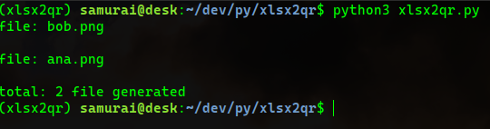

# xlsx2qr
Script that provide a machanism to dump users from xlsx to generate single qrcode to each user
## How to install and configure :point_left:

The first step is to install python3 interpreter on your os.

You can downloaded and install from python official website, click [here](https://www.python.org/downloads/).

### :point_right: Configure the Script 

To configure the you need to following:

>[!TIP]
> I recommend to configure this script in a virtual environment.
> with `python3 -m venv xlsx2qr` after to clone the repo, for more info, check [here](https://docs.python.org/3/library/venv.html)
```
  git clone https://github.com/mr0xff/xlsx2qr.git
  python3 -m venv xlsx2qr
  cd xlsx2qr
  source bin/activate
  pip install -r requirements.txt
```
### Running the Script 

After to configure the script you can run the script

>[!IMPORTANT]
>Check the **[format-doc.xlsx](format-doc.xlsx)** to configure your users.
>Keep the column formats and chenge only the lines values

#### keeping ... 

```
  python3 xlsx2qr.py
```
### Demo Pictures 
> Example




> Example of qrcode view


> Example mobile scanned code


Good scripting :clap: :wine_glass: :partying_face:
